# FHIR Lab Reports
A CDS Hooks enabled SMART on FHIR application to increase the clinical utility of pharmacogenomic laboratory test results.

This application has two parts:

1. The first part creates the FHIR resources which represent the results of a [Statin Sensitivity test](http://ltd.aruplab.com/tests/pub/2008426?_ga=2.151186748.482150862.1575306350-1329666903.1575306350). It mocks the current layout of the [PDF report](http://ltd.aruplab.com/Tests/DownloadReport/2008426%2C%20Positive.pdf) used by the laboratory where this test is offered. An input space is provided at the bottom to designate a destination FHIR server where the created resources will be sent. These resources are used by the second part of the application. This simulates the backend functionality which would need to be in place at laboratories to generate test results as FHIR resources rather than as PDF reports.

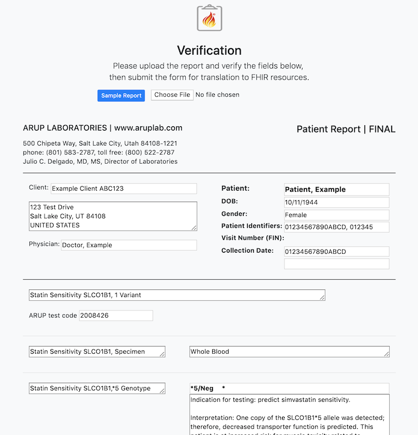            |  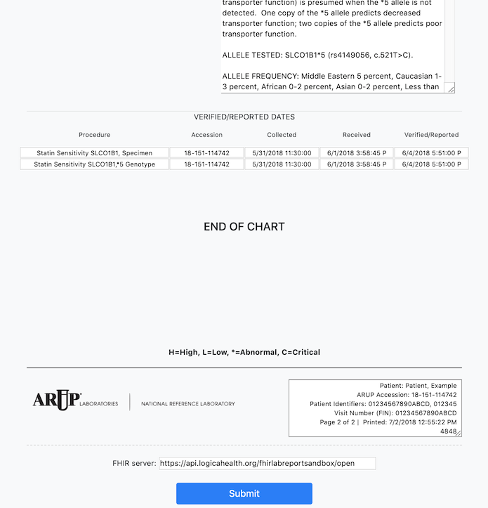
:-------------------------:|:-------------------------:

2. The second part provides an interactive CDS enabled environment to review the results generated in part 1. This is the SMART enabled portion of the application which would be launched within the EHR of the ordering clinic.

This part is also CDS Hooks enabled to ensure that those results can be hooked into all future relevant clinical encounters.

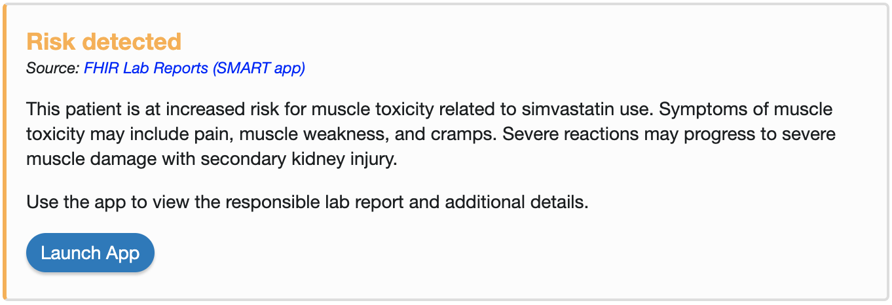

## Instructions
This project uses a Docker image to include the needed dependencies for the app server.  Follow [this guide](https://docs.docker.com/install/) to install Docker on your machine and check installation success with docker -v. Then follow [this guide](https://docs.docker.com/compose/install/) to install Docker Compose and check that installation with docker-compose -v.

Launch the server with the command <code>docker-compose up --build</code>

### Create data server

This example will use the [HSPC Sandbox](https://sandbox.hspconsortium.org/).

1. Create an account.
2. Create a new sandbox with the following options and any name you would like to use.

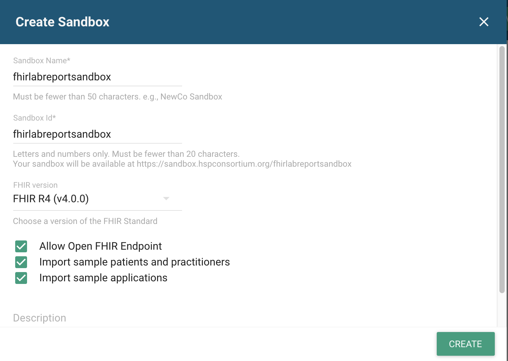

### Generate the resources
Navigate your web browser to http://localhost:3000/lab

**Important!!** <u>Before</u> you submit the sample form, enter your sandbox open FHIR endpoint URL into the server field above the submit button.

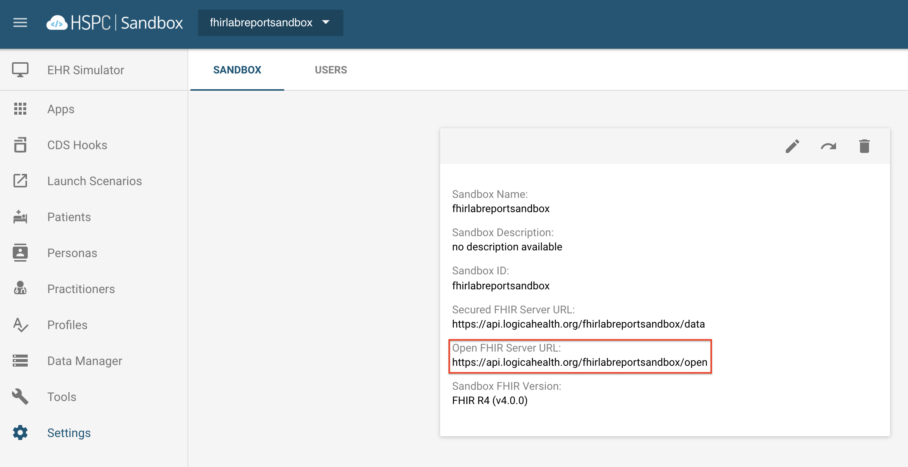

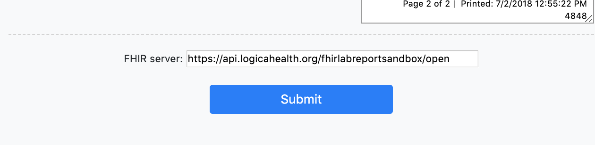

### SMART launch via CDS Hooks from the sandbox

Register the app manually within your sandbox using the following parameters and leave the rest with their defaults:

    Launch URL
    http://localhost:3000/smart-launch
    Redirect URL
    http://localhost:3000/
    Scopes
    launch patient/*.read

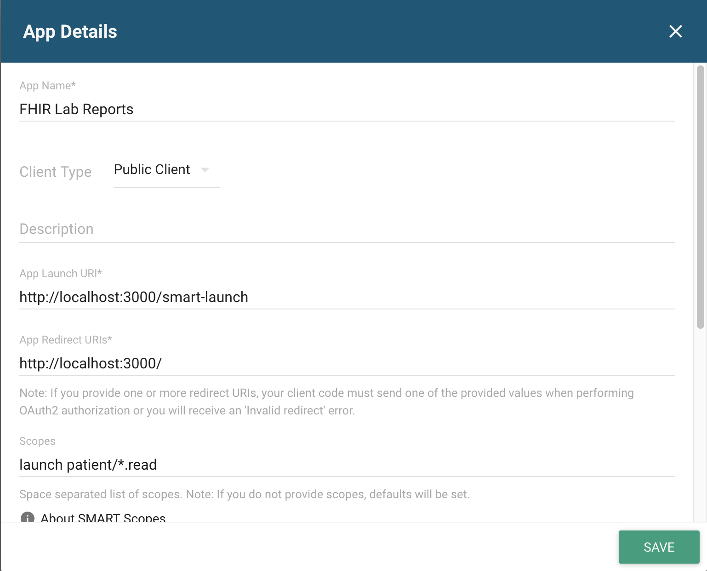

Also feel free to use <i>doc_img/icon-for-hspc.png</i> as the image for the app.

Set the client ID in <i>js/launch-smart.js</i> to the one given by the SMART service upon registering the app.

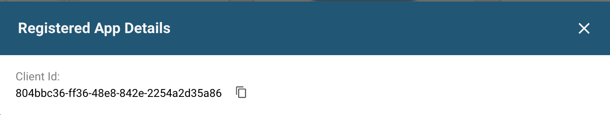

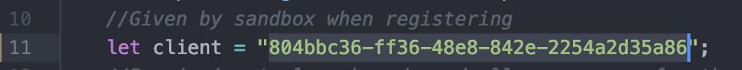

Launch the CDS Hooks Sandbox app from the HSPC app gallery.

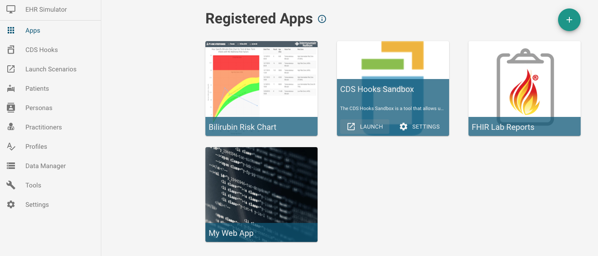

Select the patient whose report was generated in part1-lab (patient for the sample form is shown below) to perform a SMART launch.

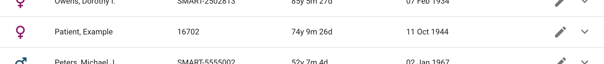

Register our application as a CDS service by clicking the cog in the upper-right corner and adding <i> http://localhost:3000/cds-services</i> as the endpoint URL.

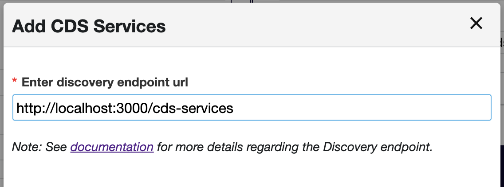

 Switch to the Rx View using tab at the top of the page and select Simvastatin as a medication to order for the patient. The CDS Hooks sandbox mimics the ordering behavior of an EHR and so is useful in testing any implementation of CDS Hooks.

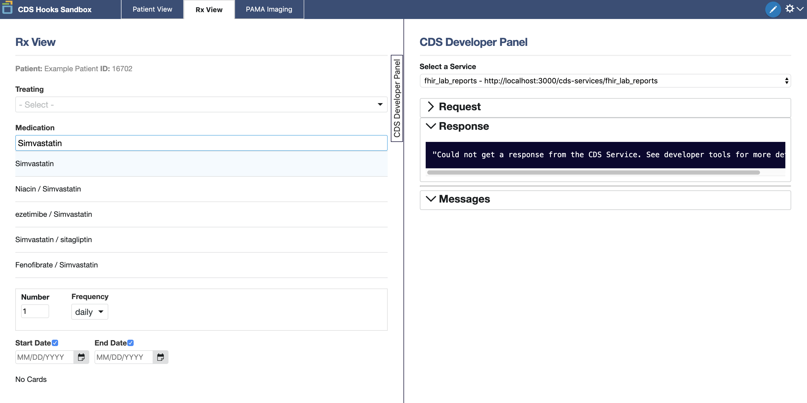

The order will return a response card with a link to launch the application.

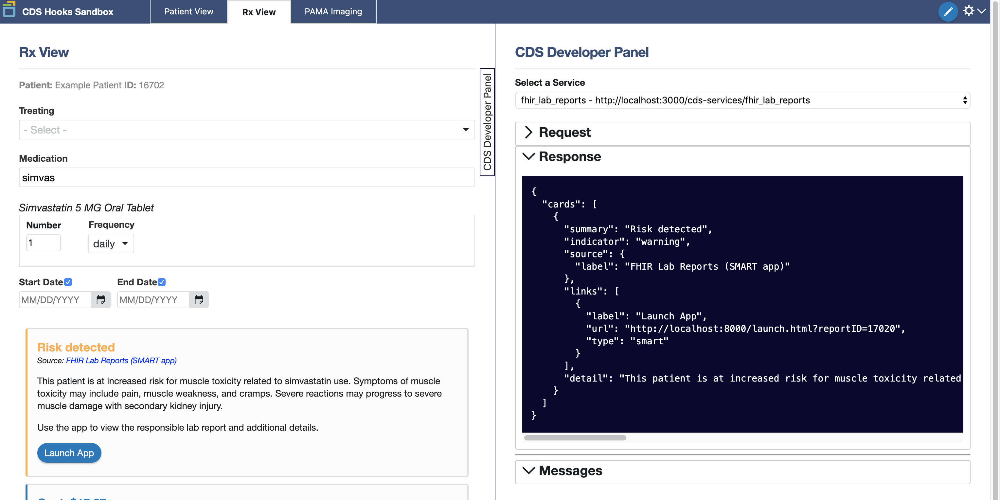

**Note:** The SMART launch can also be performed directly from the HSPC sandbox. This direct launch doesn't use CDS Hooks services. However, the same sample patient should be selected.
